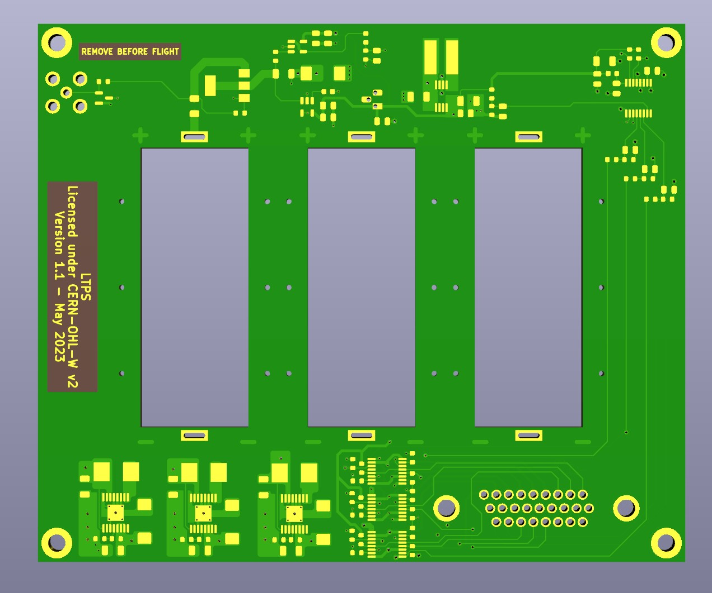

# LTPS
LTPS (LowTemperaturePowerSystem) is a power supply board designed for high-altitude balloon missions.
It provides three step-up converters and load switches as well as an ADC which can be read via I2C.

## PCB Production and part procurement  
The design is optimized to the standard JLC-PCB 4-layer process.
I bought the parts from Mouser, passives, etc. all automotive types.

