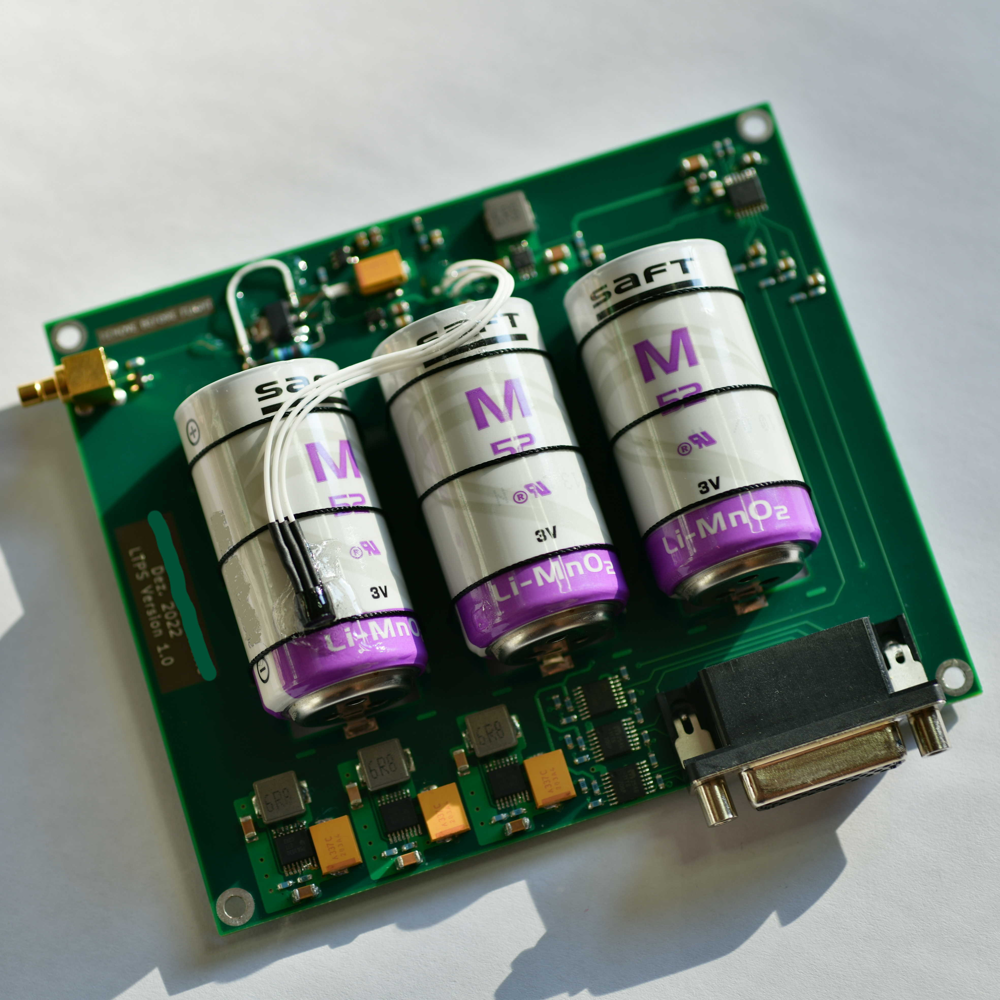

# LTPS
LTPS (**L**ow **T**emperature **P**ower **S**ystem) is a power supply board designed for high-altitude balloon applications.
It provides three step-up converters and load switches as well as an ADC which can be read via I2C.

The board measures 120*100mm, its 4 layers.

## PCB Production and part procurement  
The design is optimized to the standard JLC-PCB 4-layer process.
I bought the parts from Mouser, all automotive types because its just a private project 
I can't provide you a "clean" BOM.

This version here incorporates all bugfixes from the first one i built:

One can see the bodge on the upper left of the pcb, I also fixed up some spacing etc.

The board is designed to hold three "SAFT M52 LiMno2" cells which are ideal for high altitude ballooning, but expensive, one can 
definitely use some other (lithium cells) in "C" size.

Please consult the schematic and the according datasheets for modifications etc.

